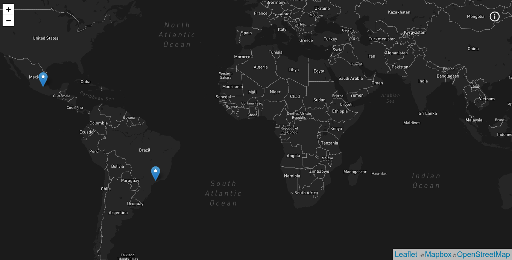

<h1 style="text-align: center">My trips</h1>
<p>
A simple project to show in a map the places that I went and show more
informations and photos when clicked
</p>



## Technologies used
  - [NextJS](https://nextjs.org)
  - [Typescript](https://www.typescriptlang.org)
  - [Styled Components](https://www.styled-components.com)
  - [Grapghcms](https://graphcms.com/)

  https://graphcms.com/

## Config used
  - [Eslint](https://eslint.org)
  - [Husky](https://typicode.github.io/husky/#/)
  - [Lint Staged](https://github.com/okonet/lint-staged)
  - [Jest](https://jestjs.io)
  - [Testing Library React](https://testing-library.com/docs/react-testing-library/intro/)
  - [Editor Config](https://editorconfig.org/)
  - [PWA](https://web.dev/progressive-web-apps/)

### GraphCMS

This project uses [GraphCMS](https://graphcms.com/), so you need to create an account there first.

After you need to create the Schema, just follow the steps:

- Schema > Add New Model with `Place` name
- And add the following fields:
  - `Single Line Text` as `name`
  - `Slug` as `slug`
  - `Map` as `location`
  - `Rich Text` as `description`
  - `Asset Picker` as `gallery`

- Schema > Add New Model with `Page` name
- And add the following fields:
  - `Single Line Text` as `heading`
  - `Slug` as `slug`
  - `Rich Text` as `body`

After that, fill some values and don't forget to `publish`!

#### Authentication

In order to create a token access, go to `Settings > API Access`, inside this page, find `Permanent Auth Tokens`,
create a Token Name and mark all queries possible. Save and get the token.

## Getting Started

First, install all dependencies:

```bash
yarn install
```

Second, run the development server:

```bash
yarn dev
```

## Commands

- `dev`: runs your application on `localhost:3000`
- `build`: creates the production build version
- `start`: starts a simple server with the build production code
- `lint`: runs the linter in all components and pages
- `lint:fix`: runs the linter in all components and pages and fix,
- `test`: runs jest to test all components and pages
- `test:watch`: runs jest in watch mode
- `lint-staged`: run lint-staged,
- `prepare`: husky install,
- `codegen`: generates graphql typing

Open [http://localhost:3000](http://localhost:3000) with your browser to see the result.

